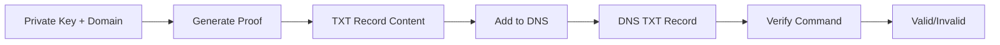

# Wallet-to-Domain Lookup System

A secure CLI tool for associating cryptocurrency wallet addresses with domain names using DNS TXT records. This system enables verifiable links between wallets and domains through cryptographic proofs stored in DNS.

## Features

- 🔐 **Cryptographic Verification**: Uses EIP-191 signatures for secure wallet-to-domain associations
- 🌐 **DNS-Based**: Leverages existing DNS infrastructure for decentralized verification
- 🛠️ **Local CLI Tool**: Runs entirely on your machine with no external dependencies
- 🔄 **Cross-Platform**: Works on Windows, macOS, and Linux
- 📋 **Simple Interface**: Easy-to-use commands for generation and verification
- 🚀 **Self-Contained**: Single JavaScript file with all dependencies bundled

## Quick Start

### Prerequisites
- Node.js v18 or higher
- Administrative access to your domain's DNS settings

### Installation

```bash
# Clone the repository
git clone <repository-url>
cd wallet-domain-lookup

# Install dependencies
npm install

# Build the tool
npm run build
```

### Basic Usage

**Generate a wallet-to-domain proof using MetaMask (Recommended):**

1. **Open the browser signing interface:**
```bash
node dist/wallet-tool.js browser
```

2. **Open the displayed URL in your browser** and follow these steps:
   - Connect your MetaMask wallet
   - Enter your domain name
   - Click "Generate Signature"
   - Copy the generated CLI command and TXT record

3. **Run the CLI command** (generated by the browser tool):
```bash
node dist/wallet-tool.js generate-from-signature "example.com" "0xYourWalletAddress" "timestamp" "nonce" "signature"
```

**Or generate directly with private key (Less Secure):**
```bash
node dist/wallet-tool.js generate example.com 0xYourPrivateKey
```

**Add the generated TXT record to your DNS:**
- Record Name: `aqua._wallet.example.com`
- Record Value: `wallet=0xAbC123...;nonce=a1b2c3d4e5;timestamp=1234567890;sig=0xdef456...`

**Verify the association:**
```bash
node dist/wallet-tool.js verify example.com wallet1
```

## How It Works

1. **Proof Generation**: Creates a cryptographic signature linking your wallet address to a domain name
2. **DNS Storage**: You manually add the proof as a TXT record in your domain's DNS
3. **Verification**: Anyone can verify the association by querying DNS and validating the signature

### Technical Process



## DNS Record Format

**Record Name Pattern:**
```
aqua._wallet.<your-domain.com>
```

**Record Value Format:**
```
wallet=<address>;nonce=<nonce>;timestamp=<timestamp>;sig=<signature>
```

**Example:**
- **Name**: `aqua._wallet.mycompany.com`
- **Value**: `wallet=0x742d35Cc6734C0532925a3b8D0a69e0019...&timestamp=1703123456&sig=0x8f2e4d...`

## Use Cases

### 🏢 Corporate Verification
Link your company domain to wallet addresses:
```bash
# Generate proof for main wallet using MetaMask
node dist/wallet-tool.js browser
# Follow browser instructions, then add TXT record at: aqua._wallet.mycompany.com
```

## Security Features

- **Data Integrity**: Cryptographic signatures ensure proof authenticity
- **No Data Storage**: Private keys are never stored or transmitted
- **Local Execution**: All operations run on your local machine

## Commands Reference

### Browser Command (Recommended)
```bash
node dist/wallet-tool.js browser
```
Opens instructions for browser-based MetaMask signing. This is the most secure method as it never exposes private keys to the CLI.

### Verify Command  
```bash
node dist/wallet-tool.js verify <domain>
```
- `<domain>`: Domain to verify (e.g., `example.com`)

### Help
```bash
node dist/wallet-tool.js --help
node dist/wallet-tool.js generate --help
node dist/wallet-tool.js verify --help
```

## Development

### Project Structure
```
src/
├── index.ts      # CLI interface
├── proof.ts      # Proof generation logic
├── verify.ts     # Verification logic
└── types.ts      # TypeScript interfaces

docs/
└── guide.md      # Detailed user guide

build.js          # Build script
```

### Building
```bash
npm run build     # Creates dist/wallet-tool.js
```

### Development Mode
```bash
npm run dev       # Compile and run
```

## Troubleshooting

### DNS Propagation Issues
- DNS changes can take 1-24 hours to propagate globally
- Use online DNS checker tools to verify record existence
- Try verification from different networks/locations

### Common Errors
| Error | Solution |
|-------|----------|
| "Invalid private key" | Ensure key starts with `0x` and is 64 hex characters |
| "DNS record not found" | Check record name format and DNS propagation |
| "Signature verification failed" | Verify TXT record content exactly matches generated proof |

### Manual DNS Verification
```bash
# Check if DNS record exists
dig TXT aqua._wallet.yourdomain.com

# Windows alternative
nslookup -type=TXT aqua._wallet.yourdomain.com
```

## Contributing

1. Fork the repository
2. Create a feature branch
3. Make your changes
4. Add tests if applicable
5. Submit a pull request

## Security Considerations

- Use dedicated wallets for domain associations when possible
- Regularly audit your DNS records for unauthorized changes
- Enable DNSSEC if your DNS provider supports it
- Use strong passwords for your DNS provider account

Built with TypeScript, ethers.js, and modern cryptographic standards for secure wallet-to-domain verification. 
